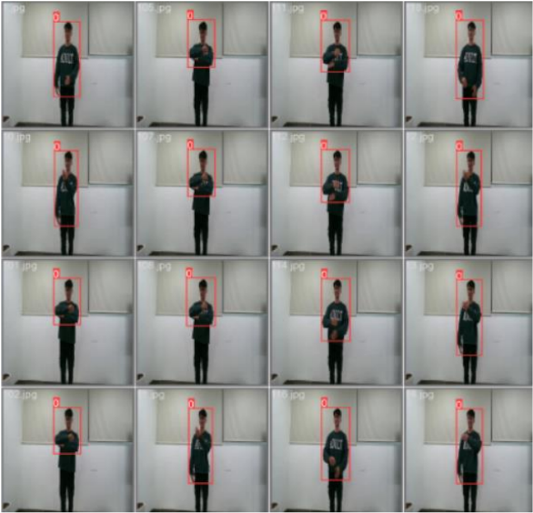

# Sign language recognition

Sign language recognition là một dự án mã nguồn mở nghiên cứu phường pháp sử dụng trí tuệ nhân tạo phục vụ nhận dạng ngôn ngữ cử chỉ hỗ trợ người khiếm khuyết.


## Cài đặt

1. Clone dự án

```bash
  git clone https://github.com/quang0308031/computer_vision.git
```
2. Thư viện cần thiết
```bash
  pip install requirements.txt
```

    
## Chuẩn bị dữ liệu
Bước đầu tiên trong chuẩn hóa dữ liệu là trích xuất frame từ các video chứa hành động củ chỉ và lưu các farame vào một file. Lưu ý mỗi mộ file là một video cần chưa trong một tệp.

Tiếp theo, chúng ta cần có một mô hình YOLO để khoanh vùng những phần quan trọng cần chú ý trong ảnh. Ví dụ:

^^