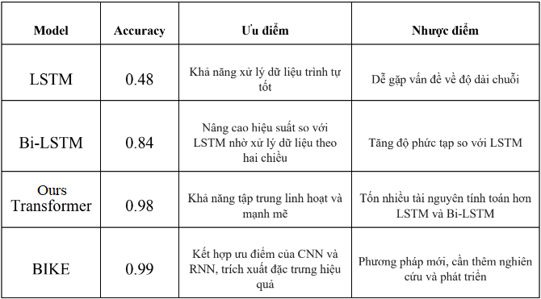

# Sign language recognition

Sign language recognition là một dự án mã nguồn mở nghiên cứu phường pháp sử dụng trí tuệ nhân tạo phục vụ nhận dạng ngôn ngữ cử chỉ hỗ trợ người khiếm khuyết.


## Cài đặt

1. Clone dự án

```bash
  git clone https://github.com/quang0308031/computer_vision.git
```
2. Thư viện cần thiết
```bash
  pip install requirements.txt
```

    
## Chuẩn bị dữ liệu
Bước đầu tiên trong chuẩn hóa dữ liệu là trích xuất frame từ các video chứa hành động củ chỉ và lưu các farame vào một file. Lưu ý mỗi mộ file là một video cần chưa trong một tệp và những tệp chứa các frame cùng ý nghĩa sẽ chứa trong một tệp có tên là ý nghĩa của hành động đó.

Tiếp theo, chúng ta cần có một mô hình YOLO để khoanh vùng những phần quan trọng cần chú ý trong ảnh. Ví dụ:


Để có thể cắt và lưu trữ các vùng được được cắt, chúng ta sẽ chạy đoạn mã sau:
```python
from preprocessing.crop import crop_and_save
crop_and_save(model_path = 'path to model YOLO',
              conf = 'confident score',
              data_path = 'path to data folder',
              det = 'path to save folder',
              img_size = 'size of images')
```
Chuyển dữ liệu từ các frame sang mảng numpy và lưu dưới dang .npy:
```python
from preprocessing import data_generator
data_generator.video2array(data = 'path to data',
                           det = 'path to save')
```
Cuối cùng, để tạo ra dữ liệu phù hợp với đầu vào của mô hình:
```python
data_generator.padding(data = 'path to data', 
                       det = 'path to save', 
                       max_len = 'max length of frames', 
                       img_size = 'images size')

data_generator.train_test_split(path = 'path to padded data')
```
Lưu ý, mô hình hoạt động tốt với ảnh GRAY, nếu sử dụng với ảnh nhiều kênh có thể phải điều chỉnh để mô hình tương thích.
## Huấn luyện mô hình
Thực hiện biên dịch và huấn luyện mô hình.
```python
import numpy as np
from Model.models import model

datas = np.load('path to train datas')
labels = np.load('path to train labels')
val_datas = np.load('path to validation datas')
val_labels = np.load('path to validation datas')

from sklearn.preprocessing import OneHotEncoder
encoder = OneHotEncoder()
labels_onehot = encoder.fit_transform(labels.reshape(-1, 1)).toarray()
val_labels_onehot = encoder.fit_transform(val_labels.reshape(-1, 1)).toarray()

transformer = model()
transformer.compile(optimizer=optimizer, loss='categorical_crossentropy', metrics=['accuracy'])
callback = tf.keras.callbacks.ModelCheckpoint('path to save model', monitor='val_accuracy', verbose=2, save_best_only=True)
history = model.fit(x=datas, y=labels_onehot, batch_size=64, epochs=100, validation_data=[val_datas, val_labels_onehot], callbacks=[callback])
```

## Đánh giá mô hình




## Tham khảo
[Attention Is All You Need](https://arxiv.org/pdf/1706.03762.pdf)
[Bidirectional Cross-Modal Knowledge Exploration for Video Recognition with Pre-trained Vision-Language Models](https://arxiv.org/pdf/2301.00182.pdf)

